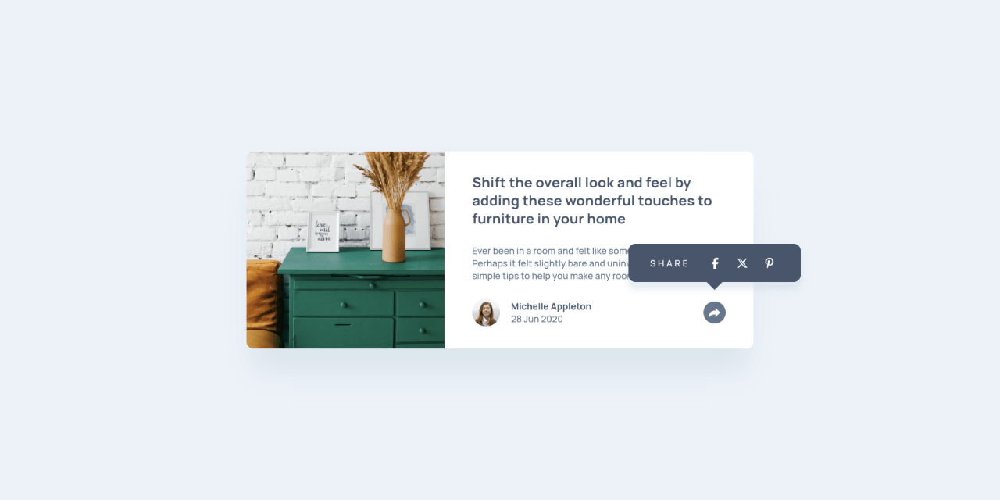
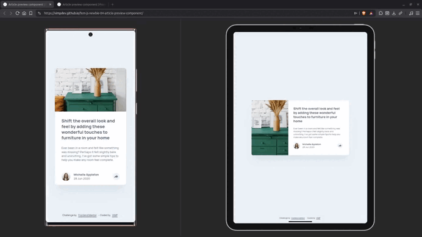

# Article Preview Component

> **Development Focus:** Semantic HTML · Accessibility · Mobile First · Progressive Enhancement · Maintainable CSS · Vanilla JavaScript

A responsive article preview component featuring an accessible share interaction, built with semantic HTML, modern CSS, and vanilla JavaScript.

---

## Live

- [**Live Preview**](https://vimpdev.github.io/fem-js-newbie-04-article-preview-component/)
<!-- - [**Frontend Mentor Solution**]() -->

---

## Demo

---

## Screenshots

| Mobile | Tablet |
| :-----: | :----: |
|  |  |

### Desktop

| Default | Expanded |
| :-----: | :----: |
|  |  |

---

## Features

- Responsive layout
- Accessible share panel
- Keyboard support (Escape to close)
- Click-outside dismissal
- Progressive enhancement

---

## Tech Stack

- **HTML5**
  - Semantic elements
  - Accessible markup

- **CSS**
  - Cascade Layers
  - Native CSS Nesting
  - Design Tokens (Custom Properties)
  - Logical Properties
  - Flexbox
  - Grid
  - Mobile-first workflow

- **JavaScript**
  - DOM manipulation
  - Event handling
  - DOM state management

- **Accessibility**
  - WAI-ARIA attributes
  - Keyboard interaction
  - Visible focus states

- **Development**
  - Progressive Enhancement
  - Mobile-first workflow

- **Tooling**
  - pnpm
  - Servor
  - Git
  - GitHub

---

## What I Learned

- Structuring semantic HTML before styling improves maintainability.
- Organizing CSS with Cascade Layers keeps responsibilities clear.
- Separating primitive and semantic design tokens makes styles easier to scale.
- Building interactions around component state leads to simpler JavaScript.
- Accessibility should evolve alongside functionality, not after it.

---

## JavaScript Highlights

### `hidden` property

Used the `hidden` property to control the visibility of the share panel while keeping the implementation simple and semantic.

### `aria-expanded`

Kept the visual state synchronized with assistive technologies by updating the `aria-expanded` attribute whenever the panel opens or closes.

### `Element.contains()`

Used `Element.contains()` to detect whether a click occurred inside the share component, allowing the panel to close only when the interaction happens outside of it.

### Keyboard interaction

Implemented support for the <kbd>Escape</kbd> key so keyboard users can dismiss the panel without using a pointing device.

---

## AI Collaboration

AI was used as a technical mentor for architectural discussions, code reviews, accessibility feedback, and concept clarification.

The project implementation, final code, and technical decisions were completed and validated manually.

---

## Author

- Frontend Mentor – [@vimpdev](https://www.frontendmentor.io/profile/vimpdev)

---

## Challenge Source

Built as a solution to the [Article preview component challenge on Frontend Mentor](https://www.frontendmentor.io/challenges/article-preview-component-dYBN_pYFT)